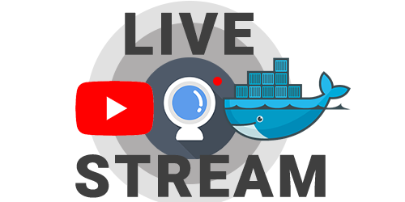

# Youtube Live Stream with Docker



With this dockerized app, you can use a webcam to stream live video to YouTube.

It was developer for Raspberry Pi, but of course it works with any type of HW as long as it supports Docker.

As I always forgot to turn on/turn off the stream, now it does it automatically based on the "present"
devices on your network. This is achieved with a MAC whitelist. If a MAC address is in the list, that means
if it's present at your network, the stream will shut down automatically. If it's not present then the stream goes live.

```
                +---------------------------+
                |                           +
                |                yes+---->stop
                |                ^        stream
                |                |
                v                +
start +-----> scan devices +---> is whitelisted MAC
                ^                present?
                |                +
                |                |
                |                v
                |                no+----->start
                |                         stream
                |                           +
                +---------------------------+
```

## Setup
#### Install Docker & Clone Repo:
1. Install `Docker` 🐳
    - `curl -sSL https://get.docker.com | sh`
2. Install `docker-compose`
    - `sudo pip install docker-compose` OR `sudo pip3 install docker-compose`
3. Clone this repo
    - `git clone https://github.com/gaborvecsei/YouTube-Live-Stream-Docker.git`
    - go inside the folder `cd Youtube-Live-Stream-Docker`
#### Configure App
1. `cd base_docker_image` then `sudo ./build_base.sh` to build the base image for the other Docker images
2. Edit `docker-compose.yml`
    - Change `YOUTUBE_LIVE_KEY` to your personal youtube live stream key which you can find at `https://www.youtube.com/live_dashboard`
    - Under `devices` change the host mapping if necessary. (By default it uses the `video0`).
        - For example if you'd like to use `video1` device than change it to: `/dev/video1:/dev/video0`
3. Whitelist device MAC addresses
    - Edit `master_app_image/code/whitelisted_devices.csv`
      - This file is responsible for keeping safe MAC addresses, so when this device is present based on `arp-scan` or `nmap` we know, we can shut down the stream
4. YouTube Private Settings
    - Don't forget to set yout live stream to `private` at [YouTube Live Dashboard](https://www.youtube.com/live_dashboard)

## Start

- `sudo docker-compose up -d`

(For logs you can use `sudo docker-compose logs` or inside the `code` folders you can find the log files)

## Stop

- `sudo docker-compose down`

## Serives (Containers)

- Device Scanner :computer:
    - Responsible to scan the devices in the local network (*localhost*)
    - Rest Api:
        ```
        GET, POST - localhost:8887/device_scan_api/scan
        result: {"device_macs": ["00:11:22:33:44:55", ...}
        ```
- YouTube Stream :camera:
    - With this we can start or stop a live stream
    - Rest Api:
        ```
        GET, POST - localhost:8888/youtube_stream_api/start
        GET, POST - localhost:8888/youtube_stream_api/stop
        GET, POST - localhost:8888/youtube_stream_api/check_health
        GET, POST - localhost:8888/youtube_stream_api/alive
        ```
- Master App :crown:
    - This is the main container which uses the above services to detect whitelisted devices and decide to start or
    stop the live streaming

## todo

- [x] device scanning for automatic streamin
- [x] master - feature architecture
- [x] create base Dockerfile
- [ ] logging to DB when was the stream live, which device, etc...
- [ ] easily switch to "basic mode". When there is no device scan, it streams when I start it.
- [x] easily editable `csv` for whitelisting
- [ ] comments
- [ ] send (Slack, Gmail, etc...) message when stream started/stopped

## About

Gábor Vecsei

- [LinkedIn](https://www.linkedin.com/in/gaborvecsei)
- [Twitter](https://twitter.com/GAwesomeBE)
- [Github](https://github.com/gaborvecsei)
- [Personal Blog](https://gaborvecsei.wordpress.com/)
